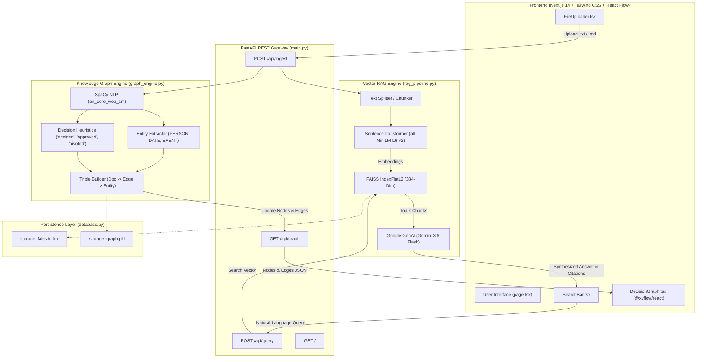
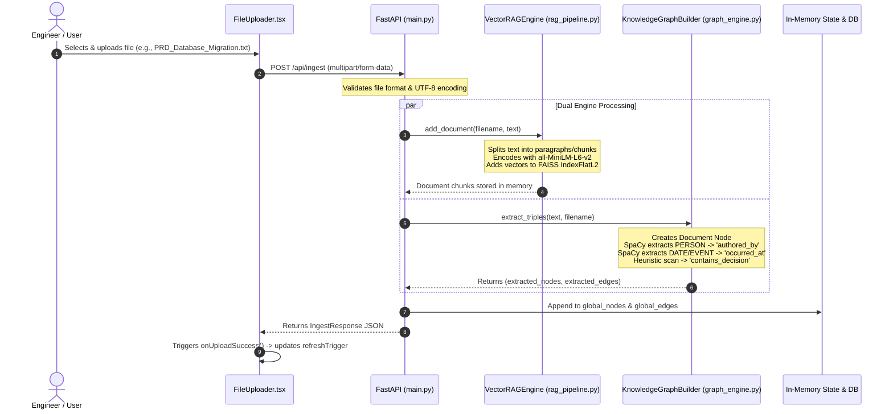
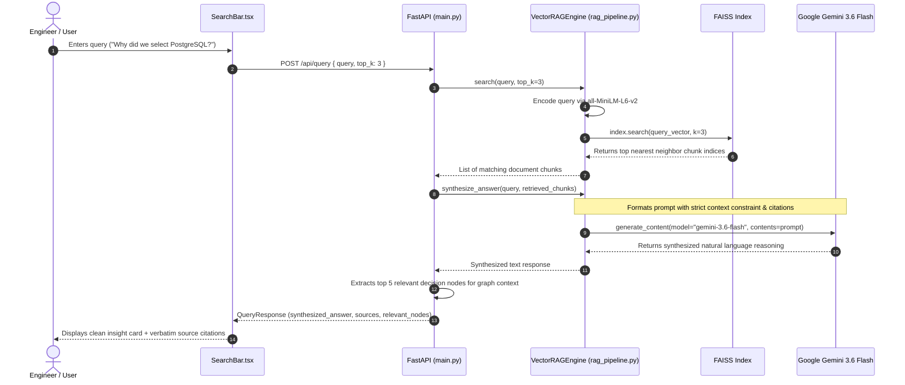

# 🧠 Institutional Memory & Decision Traceability Platform

> An enterprise-grade knowledge lineage platform combining **Knowledge Graph Extraction (SpaCy + React Flow)**, **Vector Semantic Search (FAISS + Sentence-Transformers)**, and **Generative AI (Google Gemini 3.6 Flash)** to capture, map, and trace organizational decisions and architectural context.

---

## 📑 Table of Contents

- [Overview & Value Proposition](#-overview--value-proposition)
- [System Architecture](#-system-architecture)
- [Component Architecture & Breakdown](#-component-architecture--breakdown)
  - [Frontend Components (Next.js 14 & React Flow)](#1-frontend-components-nextjs-14--xyflowreact)
  - [Backend Components (FastAPI & AI Engines)](#2-backend-components-fastapi--ai-pipeline)
- [End-to-End System Workflows](#-end-to-end-system-workflows)
  - [Workflow 1: Document Ingestion & Triples Extraction](#workflow-1-document-ingestion--triples-extraction)
  - [Workflow 2: Lineage Querying & AI Answer Synthesis](#workflow-2-lineage-querying--ai-answer-synthesis)
  - [Workflow 3: Real-Time Graph Canvas Rendering](#workflow-3-real-time-graph-canvas-rendering)
- [Tech Stack & Dependencies](#-tech-stack--dependencies)
- [Project Directory Structure](#-project-directory-structure)
- [API Reference](#-api-reference)
- [Installation & Quick Start](#-installation--quick-start)
  - [Prerequisites](#prerequisites)
  - [Backend Setup](#backend-setup)
  - [Frontend Setup](#frontend-setup)
  - [Sample Data Generation & Verification](#sample-data-generation--verification)
  - [Running with Docker](#running-with-docker)
- [Environment Variables](#-environment-variables)
- [Key Features & User Experience](#-key-features--user-experience)
- [Troubleshooting & FAQ](#-troubleshooting--faq)

---

## 💡 Overview & Value Proposition

### The Problem: Tribal Knowledge Loss
Modern engineering organizations lose invaluable institutional memory due to:
- **High Employee Turnover**: When senior engineers leave, the context behind critical architectural choices departs with them.
- **Scattered Documentation**: Decisions are fragmented across Slack threads, meeting transcripts, Jira tickets, and Google Docs.
- **Architectural Amnesia**: Teams frequently ask *"Why did we switch databases 6 months ago?"* or *"Who approved this authentication design?"* without clear answers.

### The Solution
The **Institutional Memory Platform** solves this by establishing a **dual-engine lineage system**:
1. **Knowledge Graph Engine**: Automatically parses text documents to uncover relational triples—connecting **Documents**, **People (authors/approvers)**, **Events/Timelines**, and **Decisions**.
2. **Dense Vector RAG Pipeline**: Chunks documents into 384-dimensional embeddings using `all-MiniLM-L6-v2`, indexed in **FAISS** for millisecond-latency cosine similarity search.
3. **Synthesized Decision Lineage**: Uses Google's **Gemini 3.6 Flash** to deliver precise natural language summaries grounded strictly in institutional records, complete with citations.
4. **Visual Canvas**: Visualizes the decision topology on an interactive `@xyflow/react` graph canvas.

---

## 🏛 System Architecture

The platform follows a decoupled, asynchronous client-server architecture:



---

## 🧩 Component Architecture & Breakdown

### 1. Frontend Components (Next.js 14 & `@xyflow/react`)

Located in [`frontend/src/components/`](file:///c:/Users/user/Desktop/CIT%20Projects/memory%20app/frontend/src/components/):

| Component | File Path | Core Responsibility |
| :--- | :--- | :--- |
| **Navbar** | [`Navbar.tsx`](file:///c:/Users/user/Desktop/CIT%20Projects/memory%20app/frontend/src/components/Navbar.tsx) | Renders the primary navigation header, logo brand, anchor links (`#features`, `#ingest`, `#graph`), and live system operational status badge. |
| **FileUploader** | [`FileUploader.tsx`](file:///c:/Users/user/Desktop/CIT%20Projects/memory%20app/frontend/src/components/FileUploader.tsx) | Handles multipart file drag-and-drop or file selection (`.txt`, `.md`). Sends payloads to `POST /api/ingest` and invokes `onUploadSuccess()` to trigger graph re-fetching. |
| **SearchBar** | [`SearchBar.tsx`](file:///c:/Users/user/Desktop/CIT%20Projects/memory%20app/frontend/src/components/SearchBar.tsx) | Provides an intuitive search input for natural language queries (e.g., *"Why did we select PostgreSQL over MongoDB?"*). Displays Gemini-synthesized insights and source citations. |
| **DecisionGraph** | [`DecisionGraph.tsx`](file:///c:/Users/user/Desktop/CIT%20Projects/memory%20app/frontend/src/components/DecisionGraph.tsx) | Interactive visual graph canvas built on `@xyflow/react`. Fetches nodes/edges from `GET /api/graph`, dynamically colors nodes by category, and animates relationship edges. |
| **Home Page** | [`page.tsx`](file:///c:/Users/user/Desktop/CIT%20Projects/memory%20app/frontend/src/app/page.tsx) | Orchestrates the top-level state (`refreshTrigger`), renders the Hero section, dynamic metrics card, 4-pillar feature grid, ingestion workspace, search panel, and the live graph visualizer. |

#### Node Categorization Palette in `DecisionGraph.tsx`:
- 📄 **Document Nodes**: Pure white background (`#ffffff`), slate border.
- 👤 **Person Nodes**: Soft lime-tinted background (`#ecfccb`), dark slate text.
- 📅 **Event/Date Nodes**: Emerald-tinted background (`#d1fae5`).
- ⚡ **Decision Nodes**: Indigo-tinted background (`#e0e7ff`) with full textual context in metadata.
- 🟢 **Edges**: Animated lime green strokes (`#84cc16`) with relation labels (`authored_by`, `occurred_at`, `contains_decision`).

---

### 2. Backend Components (FastAPI & AI Pipeline)

Located in [`backend/`](file:///c:/Users/user/Desktop/CIT%20Projects/memory%20app/backend/):

| Module | File Path | Core Responsibility |
| :--- | :--- | :--- |
| **Application Router** | [`main.py`](file:///c:/Users/user/Desktop/CIT%20Projects/memory%20app/backend/main.py) | Initializes FastAPI, sets up CORS for Next.js, manages in-memory graph state (`global_nodes`, `global_edges`), and registers the 4 core API endpoints. |
| **Knowledge Graph Builder** | [`graph_engine.py`](file:///c:/Users/user/Desktop/CIT%20Projects/memory%20app/backend/graph_engine.py) | Wraps SpaCy's `en_core_web_sm` model to run Named Entity Recognition (NER) and syntactic parsing. Extracts root document nodes, person nodes (`authored_by`), event nodes (`occurred_at`), and decision sentences (`contains_decision`). |
| **Vector RAG Engine** | [`rag_pipeline.py`](file:///c:/Users/user/Desktop/CIT%20Projects/memory%20app/backend/rag_pipeline.py) | Encapsulates document chunking, dense vector embedding generation using `sentence-transformers/all-MiniLM-L6-v2`, FAISS L2 similarity indexing, and answer synthesis using the Google GenAI SDK (`gemini-3.6-flash`). |
| **Data Schemas** | [`schemas.py`](file:///c:/Users/user/Desktop/CIT%20Projects/memory%20app/backend/schemas.py) | Defines Pydantic models for type safety across all requests and responses: `EntityNode`, `KnowledgeEdge`, `IngestResponse`, `QueryRequest`, `QueryResponse`. |
| **Persistence Utility** | [`database.py`](file:///c:/Users/user/Desktop/CIT%20Projects/memory%20app/backend/database.py) | Serialization module using `pickle` and `faiss.write_index` to persist indexed vector states (`storage_faiss.index`) and graph topology (`storage_graph.pkl`) to disk. |
| **Test Data Generator** | [`generate_test_data.py`](file:///c:/Users/user/Desktop/CIT%20Projects/memory%20app/backend/generate_test_data.py) | Generates realistic sample enterprise documents (PRDs, Architecture logs, Security audit reports) in `sample_data/` for immediate testing. |

---

## 🔄 End-to-End System Workflows

### Workflow 1: Document Ingestion & Triples Extraction



---

### Workflow 2: Lineage Querying & AI Answer Synthesis



---

### Workflow 3: Real-Time Graph Canvas Rendering

1. **State Synchronizer**: When `FileUploader.tsx` successfully uploads a document, it increments `refreshTrigger` in `page.tsx`.
2. **Dynamic Querying**: `DecisionGraph.tsx` observes changes to `refreshTrigger` and initiates `GET /api/graph`.
3. **Graph Mapping**:
   - Backend returns `nodes: EntityNode[]` and `edges: KnowledgeEdge[]`.
   - Node positions are mapped using an automated 3-column spatial layout: `x = (index % 3) * 260 + 40`, `y = floor(index / 3) * 130 + 40`.
   - Custom styling is applied based on node type (`Document`, `Person`, `Event`, `Decision`).
   - Edges are formatted with animated lime green paths and relationship labels.
4. **Interactive Canvas**: Users can zoom, pan, drag nodes, and inspect interconnected lineage visually.

---

## 🛠 Tech Stack & Dependencies

### Frontend
- **Framework**: [Next.js 14](https://nextjs.org/) (App Router, Server & Client Components)
- **Language**: TypeScript 5
- **Styling**: Tailwind CSS 3.4 with custom `@xyflow/react` overrides
- **Graph Visualization**: [`@xyflow/react`](https://reactflow.dev/) v12 (Interactive nodes, edges, zoom, controls, background dot grid)
- **Icons**: [Lucide React](https://lucide.dev/) (Modern iconography)

### Backend
- **Framework**: [FastAPI](https://fastapi.tiangolo.com/) (Asynchronous ASGI framework)
- **Server**: [Uvicorn](https://www.uvicorn.org/) (High-performance ASGI server)
- **Natural Language Processing**: [SpaCy](https://spacy.io/) with `en_core_web_sm` (Named Entity Recognition, Sentence boundary segmentation)
- **Vector Search Engine**: [FAISS CPU](https://github.com/facebookresearch/faiss) (`IndexFlatL2`, dense vector similarity)
- **Embedding Models**: [HuggingFace Sentence-Transformers](https://www.sbert.net/) (`all-MiniLM-L6-v2`, 384 dimensions)
- **Large Language Model (LLM)**: [Google GenAI SDK](https://github.com/googleapis/python-genai) (`gemini-3.6-flash`)
- **Data Validation**: [Pydantic v2](https://docs.pydantic.dev/)

---

## 📂 Project Directory Structure

```text
memory-app/
├── backend/
│   ├── .env                       # Backend secrets (GEMINI_API_KEY)
│   ├── .env.example               # Example environment template
│   ├── Dockerfile                 # Production Docker container definition
│   ├── database.py                # FAISS and Knowledge Graph state persistence (pickle)
│   ├── generate_test_data.py      # Seed script to generate mock PRDs and ADRs
│   ├── graph_engine.py            # SpaCy NLP entity & triple extraction engine
│   ├── main.py                    # FastAPI server entry point & API endpoints
│   ├── rag_pipeline.py            # SentenceTransformer, FAISS index & Gemini synthesis
│   ├── requirements.txt           # Python dependencies
│   ├── schemas.py                 # Pydantic schema models
│   └── sample_data/               # Sample project documents
│       ├── Architecture_Pivot_Log.txt
│       ├── PRD_Database_Migration.txt
│       └── Security_Audit_Report.txt
│
├── frontend/
│   ├── package.json               # Frontend dependencies & npm scripts
│   ├── postcss.config.js          # PostCSS configuration
│   ├── tailwind.config.js         # Tailwind CSS theme & color definitions
│   ├── tsconfig.json              # TypeScript compiler configuration
│   └── src/
│       ├── app/
│       │   ├── globals.css        # Global CSS rules & resets
│       │   ├── layout.tsx         # Root HTML structure & font definitions
│       │   └── page.tsx           # Main dashboard page layout
│       └── components/
│           ├── DecisionGraph.tsx  # React Flow interactive knowledge graph
│           ├── FileUploader.tsx   # Multipart document ingestion module
│           ├── Navbar.tsx         # Top navigation & system status badge
│           └── SearchBar.tsx      # Semantic query input & insight card
│
└── README.md                      # Comprehensive project documentation
```

---

## 🔌 API Reference

### 1. Health Check
- **Endpoint**: `GET /`
- **Description**: Verifies backend health and returns counts of indexed chunks and graph nodes.
- **Sample Response**:
  ```json
  {
    "status": "Institutional Memory Engine API is running",
    "indexed_chunks": 6,
    "total_graph_nodes": 12
  }
  ```

---

### 2. Ingest Document
- **Endpoint**: `POST /api/ingest`
- **Content-Type**: `multipart/form-data`
- **Parameters**: `file`: Text file (`.txt`, `.md`, UTF-8 encoded)
- **Description**: Reads document, chunks and indexes text in FAISS, and runs SpaCy NER to extract relational graph triples.
- **Sample Response**:
  ```json
  {
    "status": "success",
    "filename": "PRD_Database_Migration.txt",
    "extracted_entities": [
      {
        "id": "doc_9f1b2c",
        "label": "PRD_Database_Migration.txt",
        "type": "Document",
        "metadata": {}
      },
      {
        "id": "person_a4e81d",
        "label": "Sarah Jenkins",
        "type": "Person",
        "metadata": {}
      },
      {
        "id": "dec_c5b290",
        "label": "The team agreed and approved the migration to PostgreSQL...",
        "type": "Decision",
        "metadata": {
          "full_text": "The team agreed and approved the migration to PostgreSQL to ensure ACID compliance for transaction logging."
        }
      }
    ],
    "edges": [
      {
        "id": "e_77da12",
        "source": "doc_9f1b2c",
        "target": "person_a4e81d",
        "relation": "authored_by"
      },
      {
        "id": "e_18fa90",
        "source": "doc_9f1b2c",
        "target": "dec_c5b290",
        "relation": "contains_decision"
      }
    ]
  }
  ```

---

### 3. Get Knowledge Graph
- **Endpoint**: `GET /api/graph`
- **Description**: Fetches all extracted nodes and edges currently stored in the graph for frontend visualization.
- **Sample Response**:
  ```json
  {
    "nodes": [ ... ],
    "edges": [ ... ]
  }
  ```

---

### 4. Query Institutional Lineage
- **Endpoint**: `POST /api/query`
- **Content-Type**: `application/json`
- **Request Body**:
  ```json
  {
    "query": "Why did we decide to migrate to PostgreSQL?",
    "top_k": 3
  }
  ```
- **Sample Response**:
  ```json
  {
    "query": "Why did we decide to migrate to PostgreSQL?",
    "synthesized_answer": "Based on PRD_Database_Migration.txt authored by Sarah Jenkins, the engineering team approved replacing MongoDB with PostgreSQL to ensure ACID compliance for transaction logging.",
    "relevant_nodes": [
      {
        "id": "dec_c5b290",
        "label": "The team agreed and approved the migration to PostgreSQL...",
        "type": "Decision",
        "metadata": { ... }
      }
    ],
    "sources": [
      "[PRD_Database_Migration.txt] The team agreed and approved the migration to PostgreSQL to ensure ACID compliance for transaction logging."
    ]
  }
  ```

---

## 🚀 Installation & Quick Start

### Prerequisites
- **Python**: Version 3.10 or 3.11+
- **Node.js**: Version 18.x or 20.x
- **Package Managers**: `pip` and `npm`
- **Google Gemini API Key**: Obtainable from [Google AI Studio](https://aistudio.google.com/)

---

### Backend Setup

1. **Navigate to the backend folder**:
   ```bash
   cd backend
   ```

2. **Create and activate a Python virtual environment**:
   - **Windows (PowerShell)**:
     ```powershell
     python -m venv venv
     .\venv\Scripts\Activate.ps1
     ```
   - **Linux / macOS**:
     ```bash
     python3 -m venv venv
     source venv/bin/activate
     ```

3. **Install Python dependencies**:
   ```bash
   pip install -r requirements.txt
   ```

4. **Download the SpaCy English NLP model**:
   ```bash
   python -m spacy download en_core_web_sm
   ```

5. **Configure Environment Variables**:
   Copy `.env.example` to `.env` and set your Google Gemini API key:
   ```env
   GEMINI_API_KEY=your_gemini_api_key_here
   ```

6. **Start the FastAPI backend**:
   ```bash
   uvicorn main:app --reload --host 127.0.0.1 --port 8000
   ```
   *The backend will be available at `http://127.0.0.1:8000`. Interactive Swagger API docs are available at `http://127.0.0.1:8000/docs`.*

---

### Frontend Setup

1. **Open a new terminal and navigate to the frontend folder**:
   ```bash
   cd frontend
   ```

2. **Install Node.js dependencies**:
   ```bash
   npm install
   ```

3. **Start the Next.js development server**:
   ```bash
   npm run dev
   ```
   *The web application will open at `http://localhost:3000`.*

---

### Sample Data Generation & Verification

To test the system immediately with realistic data:

1. **Generate sample records**:
   ```bash
   cd backend
   python generate_test_data.py
   ```
   This creates three documents in `backend/sample_data/`:
   - `PRD_Database_Migration.txt` (Details migration from MongoDB to PostgreSQL by Sarah Jenkins)
   - `Architecture_Pivot_Log.txt` (Details evaluation and selection of FAISS by Alex Rivera)
   - `Security_Audit_Report.txt` (Details OAuth2 bearer token mandate by David Chen)

2. **Ingest Documents via UI**:
   - Open `http://localhost:3000`
   - Scroll to **Ingest Decision Record**
   - Upload each file from `backend/sample_data/`
   - Observe the graph canvas instantly populating with interconnected nodes!

3. **Test Queries**:
   - *"Why did we choose PostgreSQL over MongoDB?"*
   - *"Who evaluated vector databases and what did they choose?"*
   - *"What was decided during the security audit?"*

---

### Running with Docker

You can containerize the backend engine:

```bash
cd backend
docker build -t institutional-memory-backend .
docker run -p 8000:8000 -e GEMINI_API_KEY="your_api_key" institutional-memory-backend
```

---

## 🔐 Environment Variables

### Backend (`backend/.env`)

| Variable | Required | Description | Example |
| :--- | :---: | :--- | :--- |
| `GEMINI_API_KEY` | **Yes** (for AI synthesis) | Google AI Studio API key used by `VectorRAGEngine` to generate natural language explanations. | `AIzaSyD...` |

*(Note: If `GEMINI_API_KEY` is not provided, the system operates in fallback mode, returning direct retrieved text chunks without generative synthesis).*

---

## 🌟 Key Features & User Experience

- 🎨 **Neo-Modern Glassmorphism UI**: High-contrast palette using deep slate backgrounds (`#020617`), vibrant lime highlights (`#84cc16`), rounded aesthetic cards, and refined typography.
- ⚡ **Zero-Latency Ingestion**: Asynchronous background document parsing with immediate visual feedback.
- 🕸 **Multi-Dimensional Graphs**: Discovers hidden links between engineers, dates, and architectural decisions that are invisible in standard document folders.
- 🎯 **Grounded AI Synthesis**: No AI hallucinations—the LLM is strictly instructed to respond based only on retrieved institutional documents with file citations.
- 🔍 **Vector Semantic Search**: Matches concepts rather than exact keywords (e.g. searching *"relational database transition"* accurately finds *"PostgreSQL migration"*).

---

## ❓ Troubleshooting & FAQ

#### 1. SpaCy model not found (`Can't find model 'en_core_web_sm'`)
Run the following in your virtual environment:
```bash
python -m spacy download en_core_web_sm
```

#### 2. CORS errors in the browser console
Ensure the backend is running on port `8000` (`http://127.0.0.1:8000`) and that `main.py` has `CORSMiddleware` configured with `allow_origins=["*"]`.

#### 3. PyTorch / TensorFlow oneDNN warnings on Windows
`main.py` automatically suppresses oneDNN warnings:
```python
os.environ["TF_ENABLE_ONEDNN_OPTS"] = "0"
os.environ["USE_TORCH"] = "1"
```

#### 4. Can I ingest PDF or DOCX files?
Currently, the ingestion endpoint accepts `.txt` and `.md` files. To ingest PDFs or Word documents, you can convert them to clean text or markdown using tools like `pymupdf` or `pypdf` before uploading.

---

## 📜 License
This project is licensed under the MIT License.
